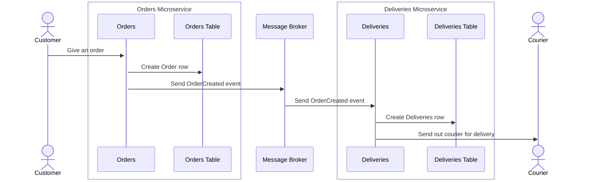
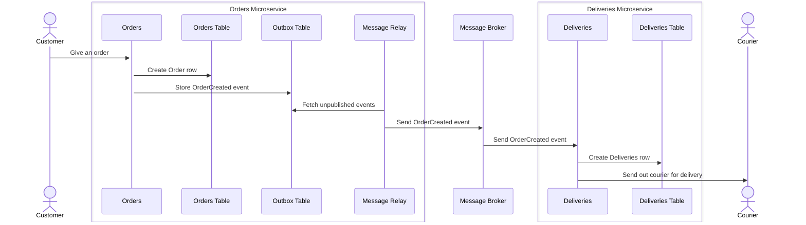

Without transactional outbox

```mermaid
sequenceDiagram
    actor Customer
    box Orders Microservice
    participant Orders
    participant Orders Table
    end
    participant Message Broker
    box Deliveries Microservice
    participant Deliveries
    participant Deliveries Table
    end
    actor Courier
    Customer ->>+ Orders: Give an order
    Orders ->> Orders Table: Create Order row
    Orders->> Message Broker: Send OrderCreated event
    Message Broker->> Deliveries: Send OrderCreated event
    Deliveries ->> Deliveries Table: Create Deliveries row
    Deliveries ->> Courier: Send out courier for delivery
```

With transactional outbox

```mermaid
sequenceDiagram
    actor Customer
    box Orders Microservice
    participant Orders
    participant Orders Table
    participant Outbox Table
    participant Message Relay
    end
    participant Message Broker
    box Deliveries Microservice
    participant Deliveries
    participant Deliveries Table
    end
    actor Courier
    Customer ->>+ Orders: Give an order
    Orders ->> Orders Table: Create Order row
    Orders->> Outbox Table: Store OrderCreated event
    Message Relay ->> Outbox Table: Fetch unpublished events
    Message Relay ->> Message Broker: Send OrderCreated event 
    Message Broker->> Deliveries: Send OrderCreated event
    Deliveries ->> Deliveries Table: Create Deliveries row
    Deliveries ->> Courier: Send out courier for delivery

```